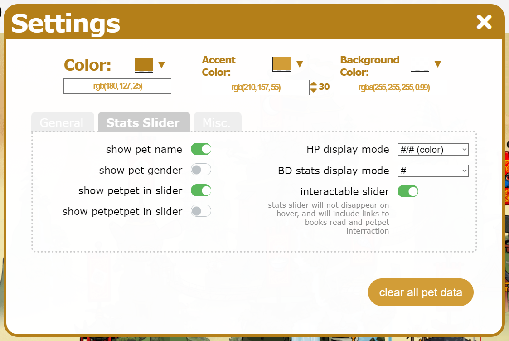

# Pet Sidebar Module
Total revamp of the pet sidebar module.     
Display or hide any number of pets, including optionally those from other accounts.   

 | BEFORE |  AFTER |
:-------------------------:|:-------------------------:
  |  
  |  

All data is stored in the browser. Settings/configuration is account-specific.    
This cosmetic script complies with Neopets site rules, and contains no automation.

---
## Installation
This script is written and tested primarily in Chrome on desktop, but appears to be compatible with all major browsers, including Firefox, Safari, Opera, and Edge. 

Please contact me on github or reddit if you encounter any issues.

### Desktop
1. Install the [Tampermonkey](https://www.tampermonkey.net/) browser extension, or other such userscript manager
2. Click [here](https://github.com/friendly-trenchcoat/Pet-Sidebar-Module/raw/master/petmodule.user.js) to install the userscript. 
3. Visit [Quick Ref](https://www.neopets.com/quickref.phtml) to populate the module

### iOS
1. Install the Userscripts app from the App Store, and enable it in your mobile browser in Settings
2. Choose or create a directory in Files where you will place the script, and select this directory in the Userscripts app
3. Go [here](https://github.com/friendly-trenchcoat/Pet-Sidebar-Module/blob/master/petmodule.user.js) and click on the download button; save the file to your chosen directory
4. In your mobile browser, click the extensions button and enable the Userscripts extension for Neopets
5. Visit [Quick Ref](https://www.neopets.com/quickref.phtml) to populate the module

### Android
I don't have one, but it probably works.

---
## Features

### Stats Hover Slider
Hover on the left of a pet image to expose pet Stats.

 

Even for inactive pets, stats are kept updated as you navigate the site.

In interactive mode, the slider stays open as you hover over it, and Books and Petpet links are added. This is configurable in the settings panel.

### Pet Naviation
Hover on the left of a pet image to expose pet Quick Links.

 

### Reminders
Reminders will display an icon over a pet linking to the relevant page when it's time to perform an action. They can be enabled or disabled in the settings panel.

 

### Collapse Module
 

### Secondary Link to Bank
 

### Removing Pets from the Sidebar Module
When the settings panel is open, remove buttons appear over each pet. 

 

When a pet is removed, it is added to a dropdown in the settings panel. You can add the pet back to the sidebar with the +, or delete the pet's data entirely with the trashcan.

 

If you still own a pet, the deleted data will be re-added upon visiting Quick Ref.

You can also easily clear all pet data in the settings panel, which is an easy first troubleshooting step if you encounter any issues.

 

---
 
##    Settings
The module is highly customizable. Change colors and enable or disable features as desired.

 

 

 

