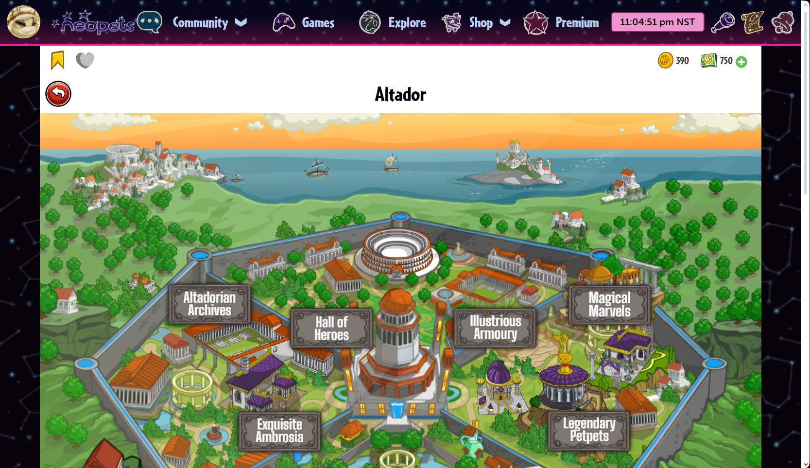

# Pet Sidebar Module
Total revamp of the pet sidebar module.     
Display or hide any number of pets, including optionally those from other accounts.   

 | BEFORE |  AFTER |
:-------------------------:|:-------------------------:
  |  
  |  

All data is stored in the browser. Settings/configuration is account-specific.    
Initialize script at [Quick Ref](https://www.neopets.com/quickref.phtml).

---
## Features

### Stats Hover Slider
Hover on the left of a pet image to expose pet Stats.

 

Even for inactive pets, stats are kept updated as you navigate the site.

In interactive mode, the slider stays open as you hover over it, and Books and Petpet links are added. This is configurable in the settings panel.

### Pet Naviation
Hover on the left of a pet image to expose pet Quick Links.

 

### Reminders
Reminders will display an icon over a pet linking to the relevant page when it's time to perform an action. They can be enabled or disabled in the settings panel.

 

### Collapse Module
 

### Secondary Link to Bank
 

### Removing Pets from the Sidebar Module
When the settings panel is open, remove buttons appear over each pet. 
 

When a pet is removed, it is added to a dropdown in the settings panel. You can add the pet back to the sidebar with the +, or delete the pet's data entirely with the trashcan.
 
If you still own a pet, the deleted data will be re-added upon visiting Quick Ref.

You can also easily clear all pet data in the settings panel, which is an easy first troubleshooting step if you encounter any issues.
 

---
 
##    Settings
The module is highly customizable. Change colors and enable or disable features as desired.

 

 

 

